# 小程序如何分享直播

### 管理后台-直播列表

#### **方式一：常用于给管理后台的工作人员**

###### **第一步：进入管理后台-直播模块-直播间管理，展示所有直播**

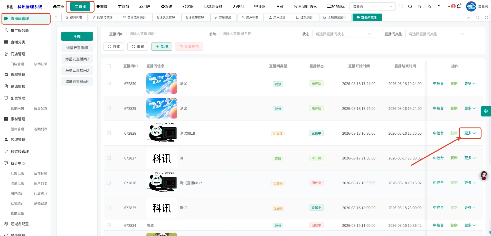

###### **第二步：选中指定的直播间，点击右侧的更多按钮，选中推广**

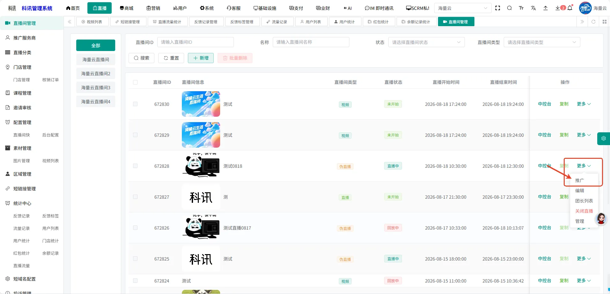

###### **第三步：点击推广后，展示直播间专属推广二维码生成弹窗**

通过二维码和复制链接两种方式可进入直播间。

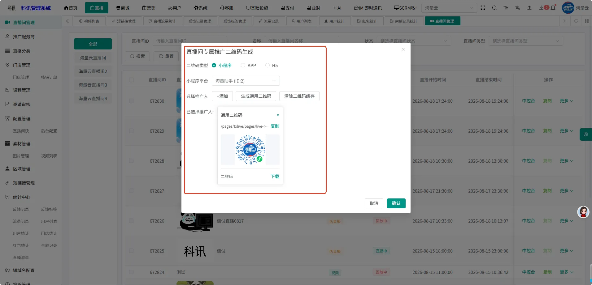

#### **方式二：常用于给部分指定的合伙人或者团长**

###### **第一步：进入管理后台-直播模块-直播间管理，展示所有直播**

###### **第二步：选中指定的直播间，点击右侧的更多按钮，选中推广**

###### **第三步：点击添加，选择指定的团长（推广人）**

通过二维码和复制链接两种方式可进入直播间。

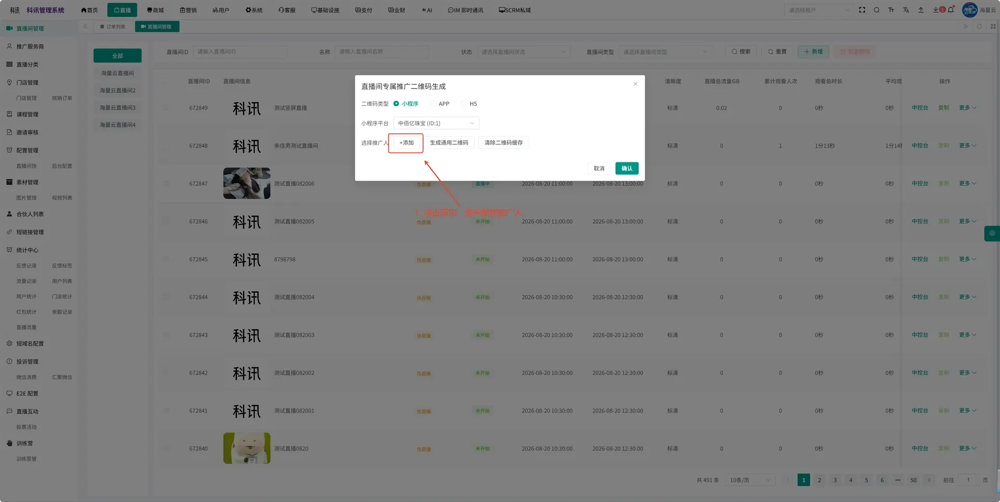

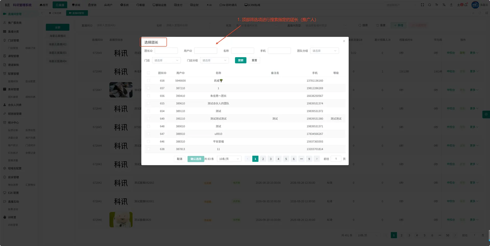

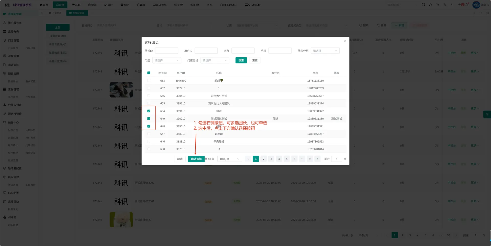

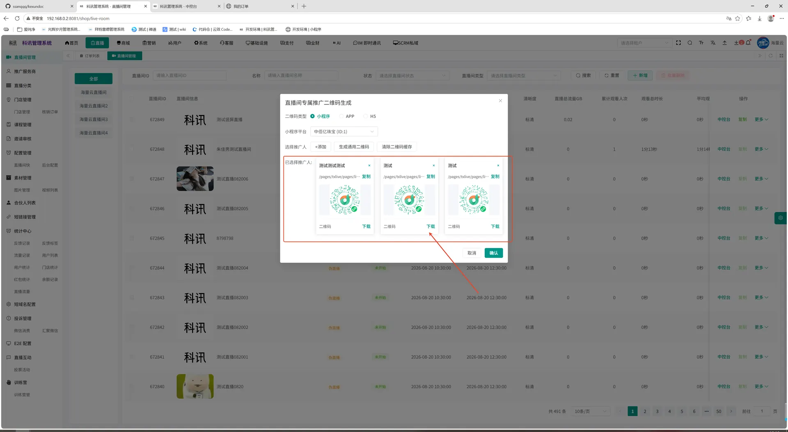

#### **方式三：常用于推广人在小程序端进行分享直播**

###### **第一步：进入管理后台-直播模块-直播间管理，展示所有直播**

###### **第二步：选中指定的直播间，点击右侧的更多按钮，选中团长列表**

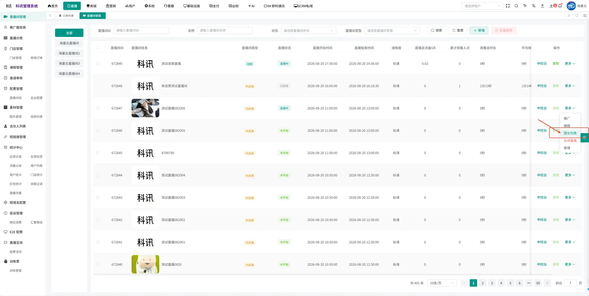

###### **第三步：选中团长列表后，展示列表弹窗，点击按钮分配团长，选择指定团长，进行分配**

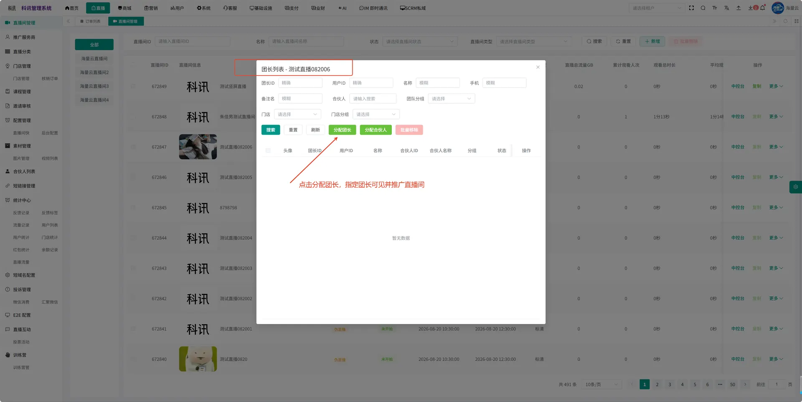

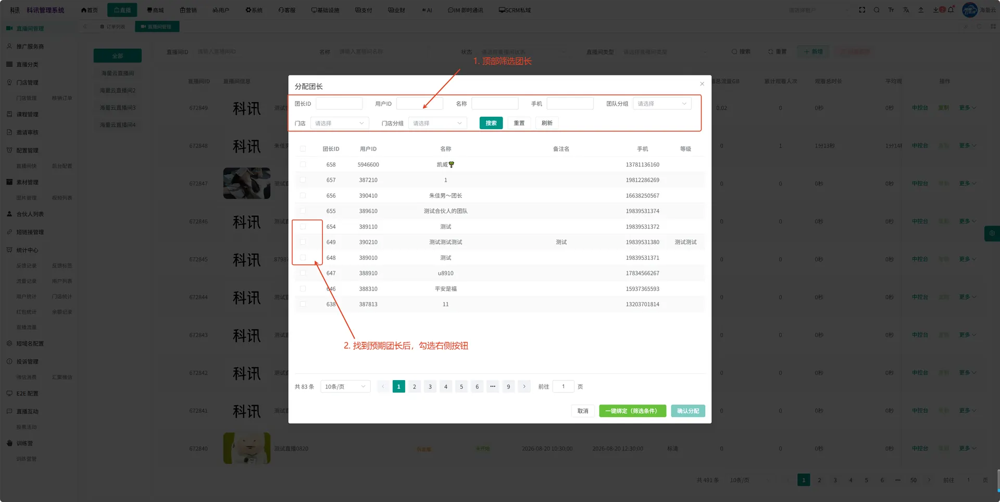

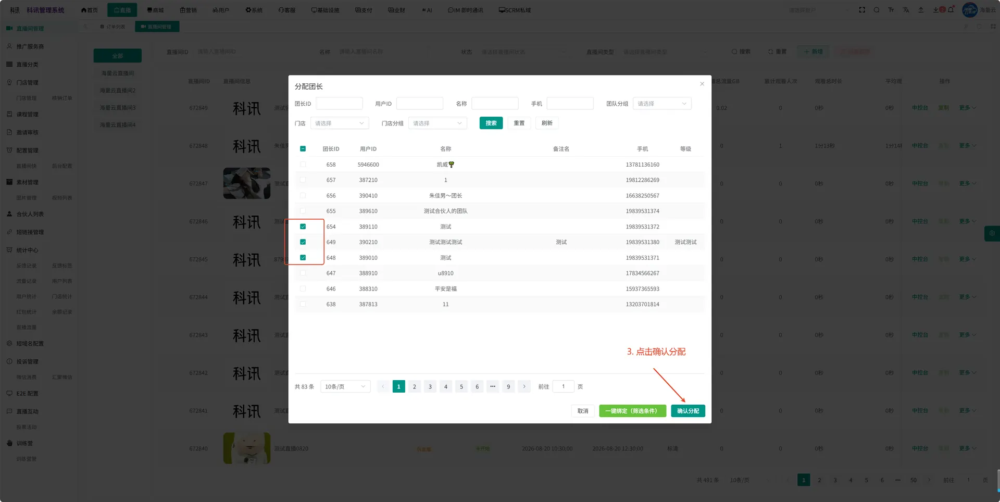

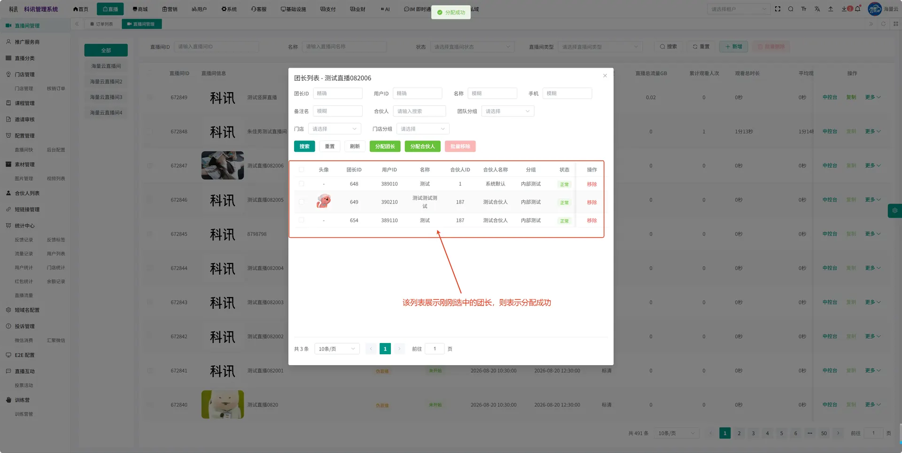

###### **第四步：对应的团长登录小程序，进入推广中心，点击工作台，可查看到推广直播**

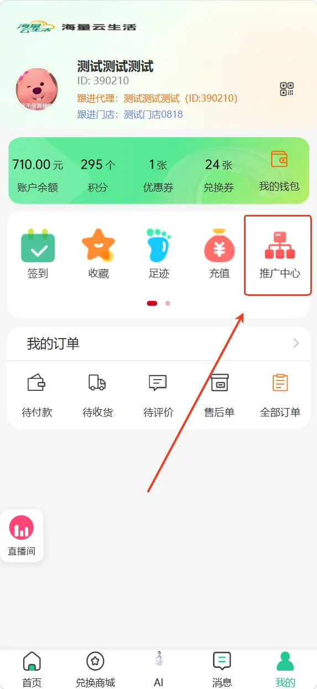

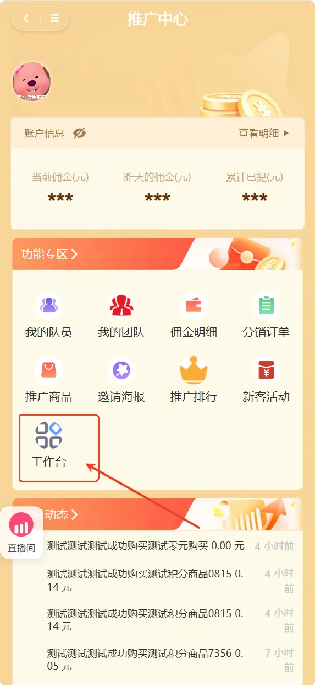

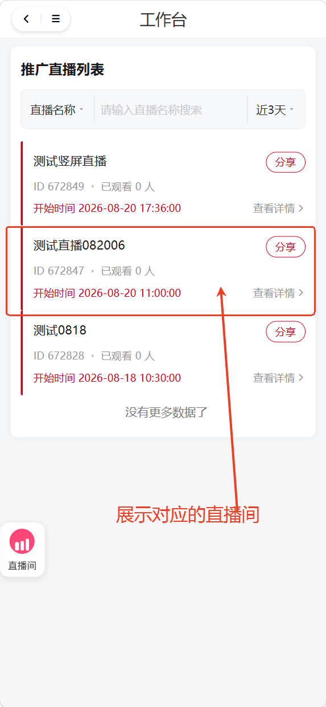

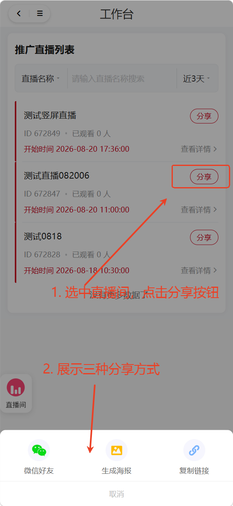
