# 怎么创建直播

### **管理后台-直播模块**

###### **第一步：进入管理后台的直播模块，选中直播间管理，展示直播间列表**

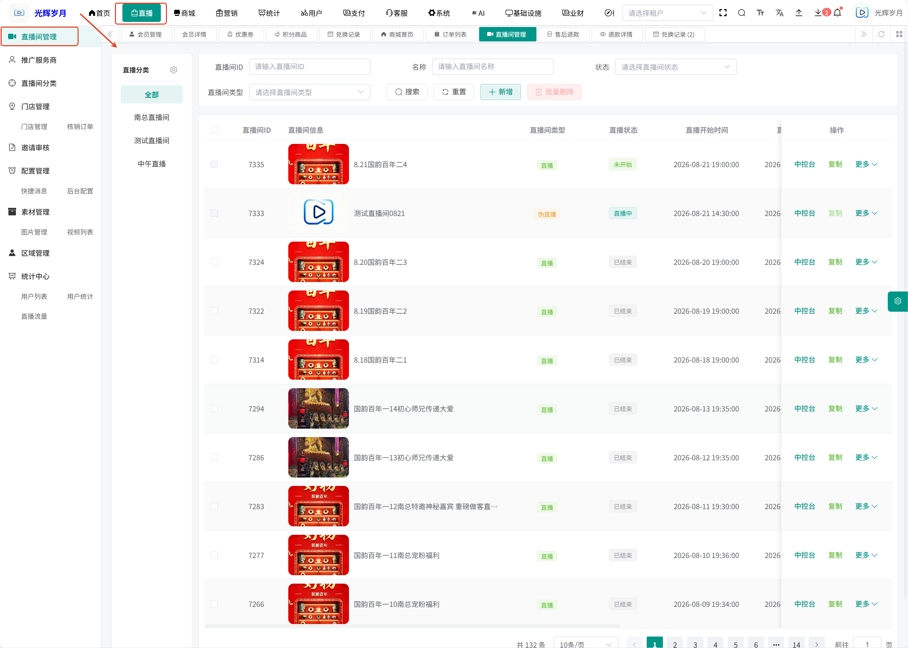

###### **第二步：点击顶部的按钮【新增】，进入填写信息页面**

直播形式 = OBS直播

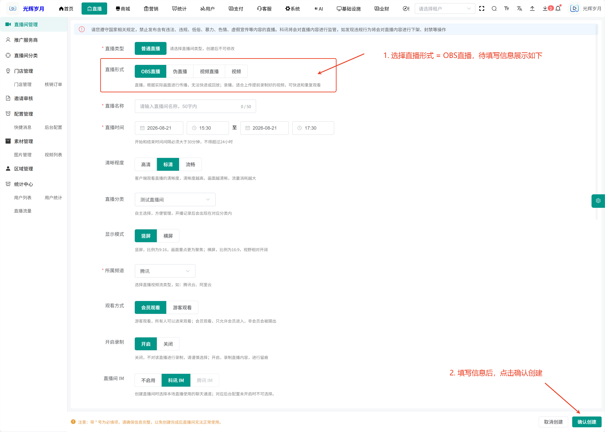

直播形式 = 伪直播

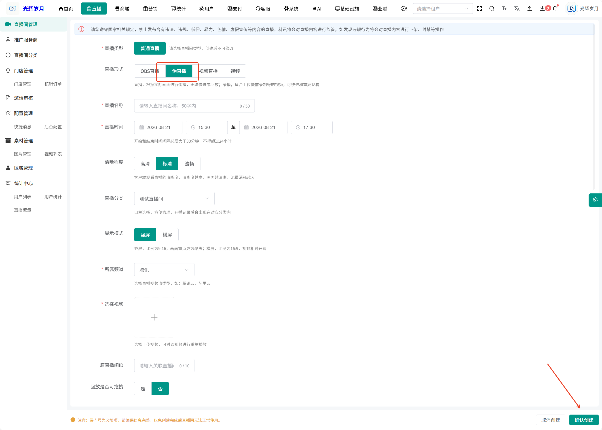

直播形式 = 视频直播

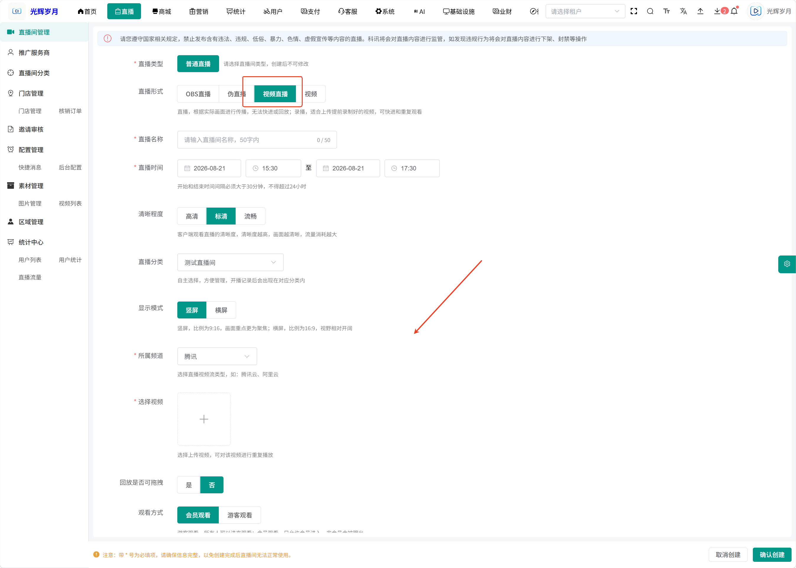

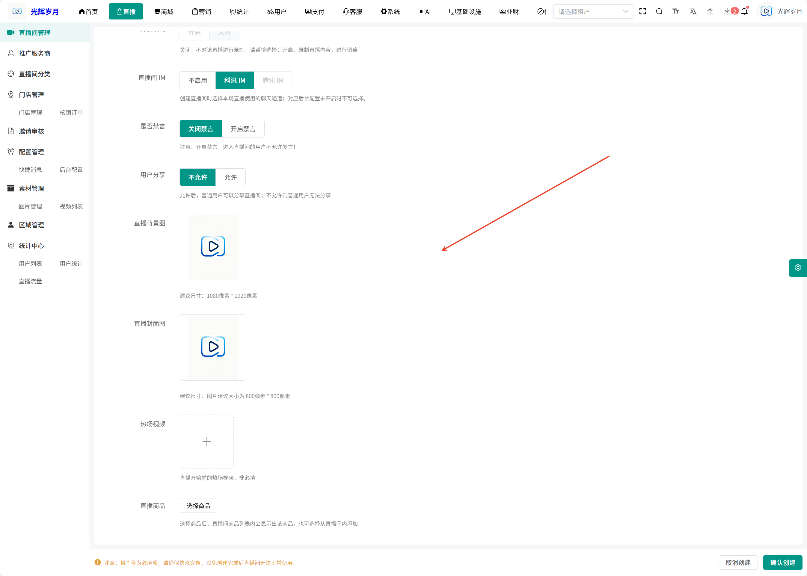

直播形式 = 视频

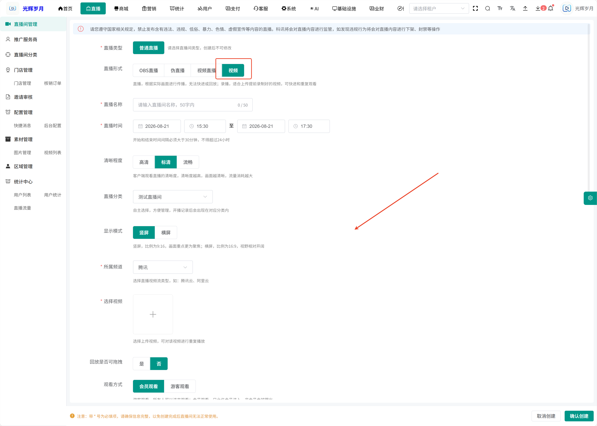

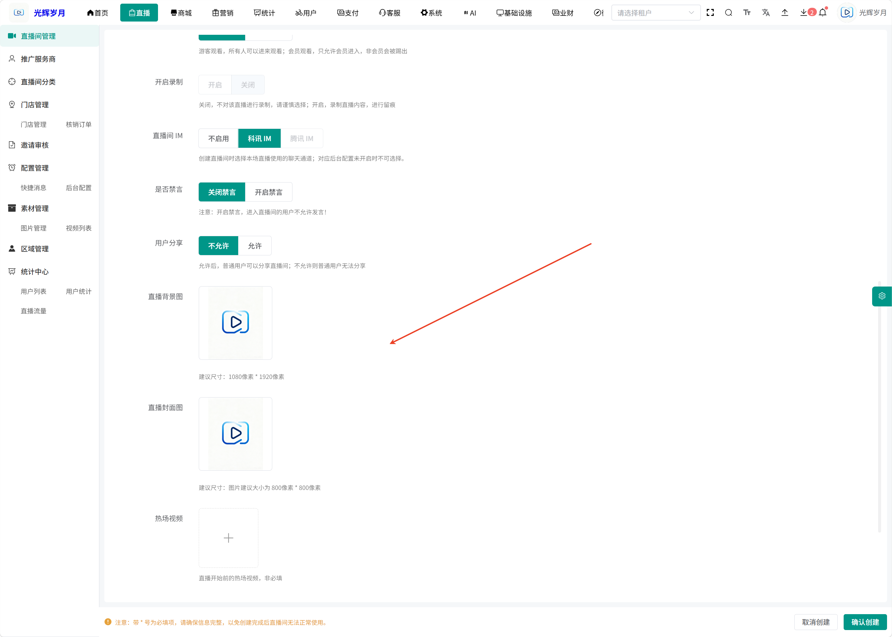

###### **第三步：确认创建后，直播间列表展示最新创建的直播间，状态处于未开始**

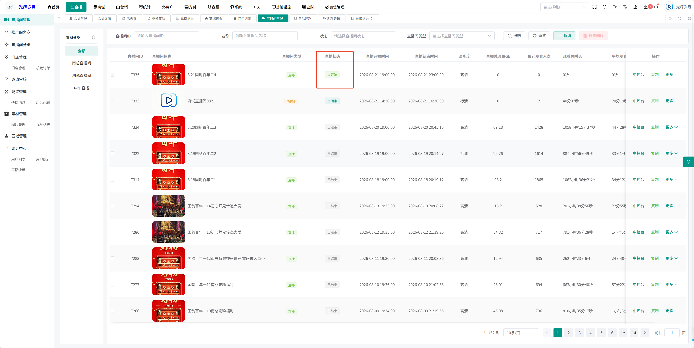

###### **第四步：点击右侧的中控台，进入中控台页面**

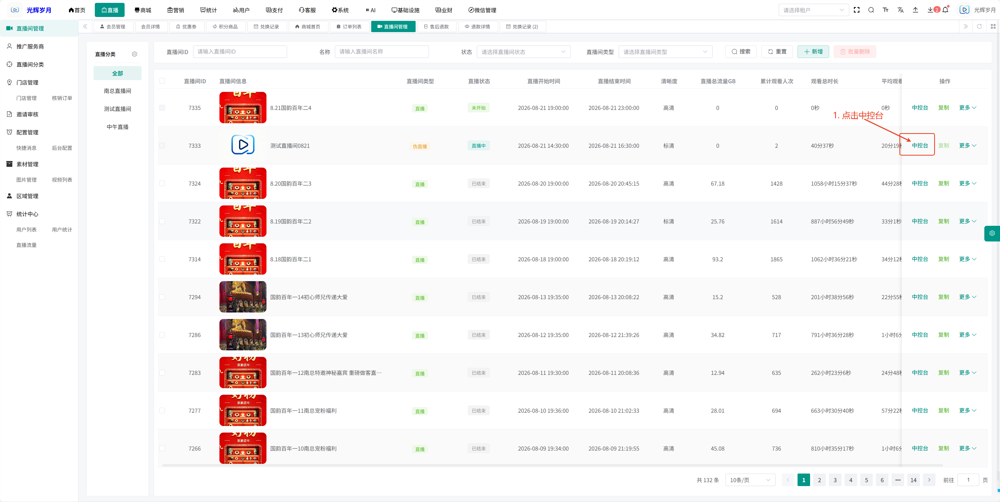

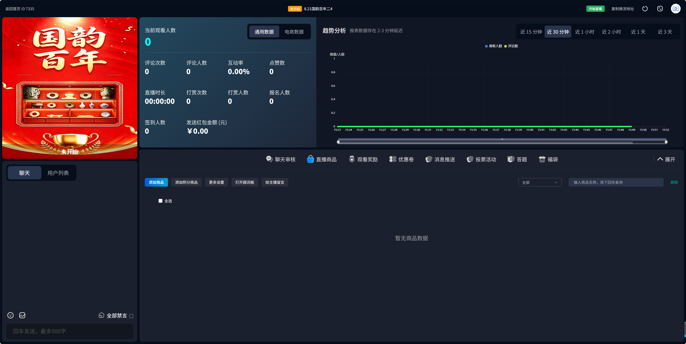

###### **第五步：直播间列表，点击开始直播，该直播间状态处于直播中**

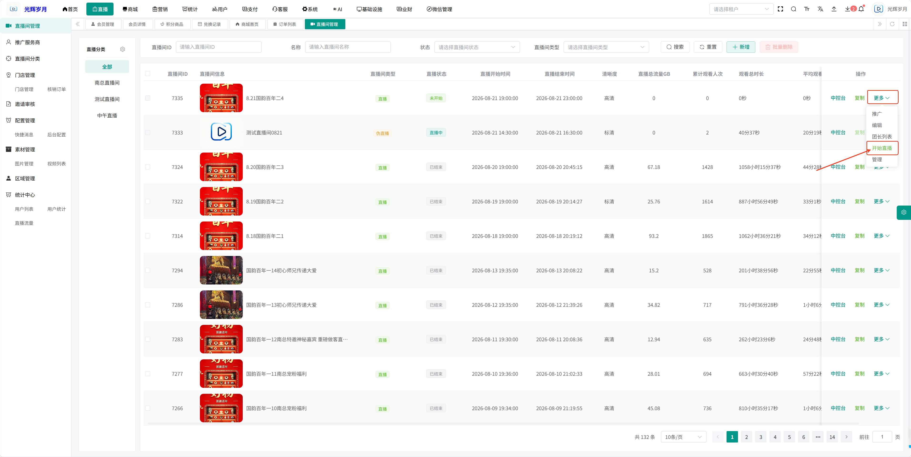
