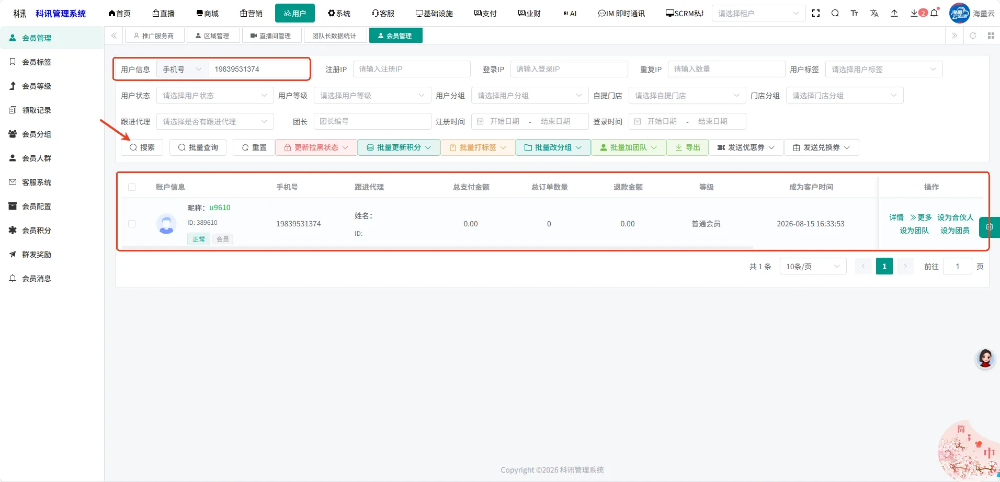
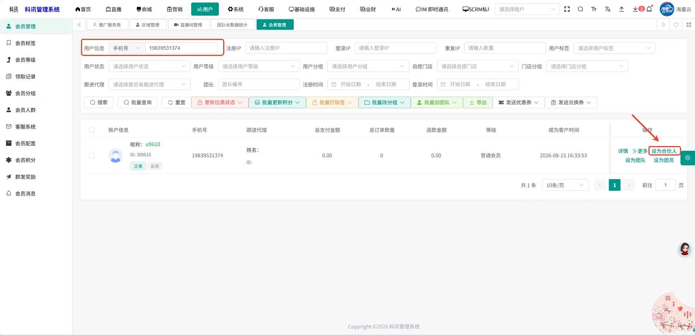
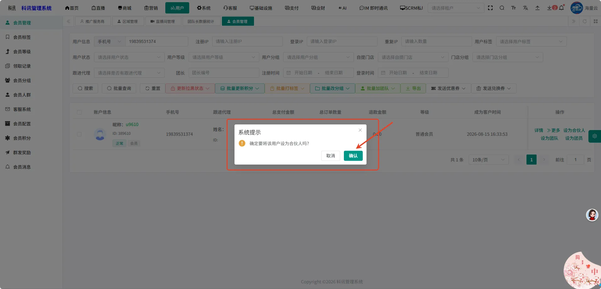
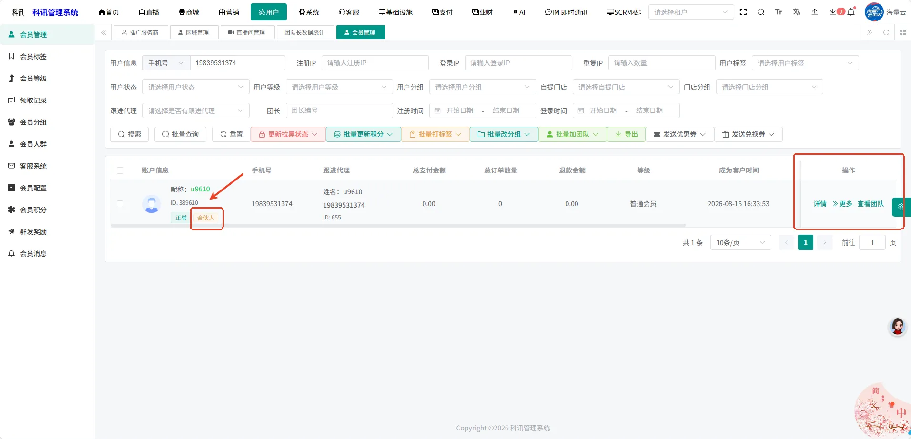
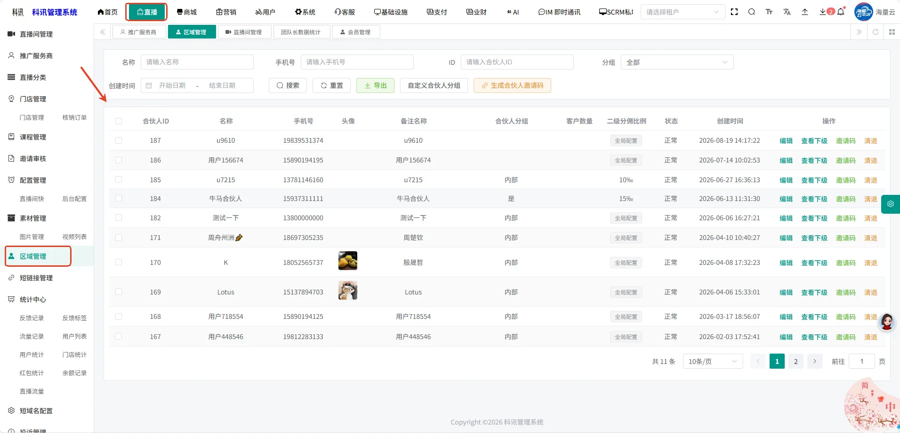
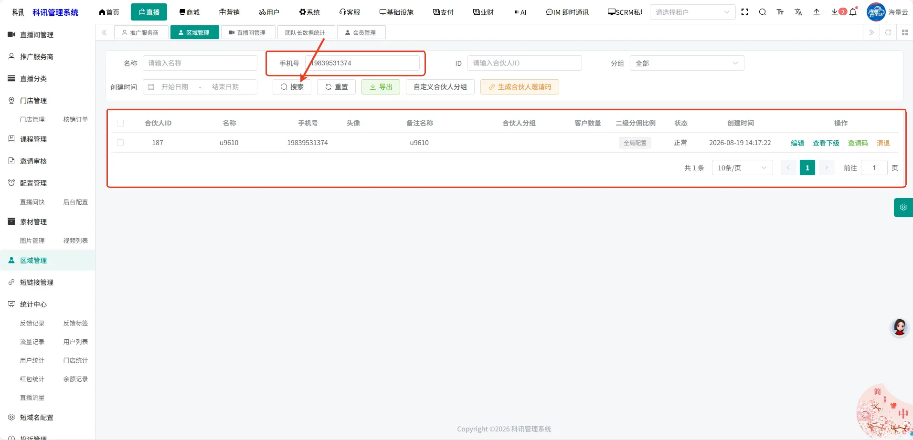
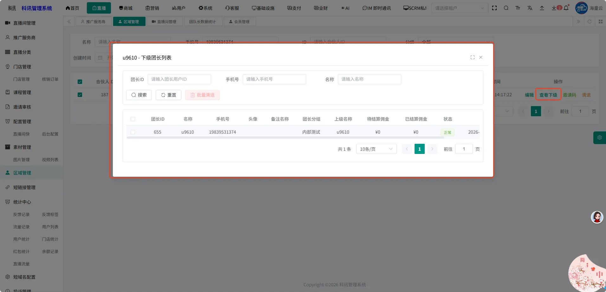
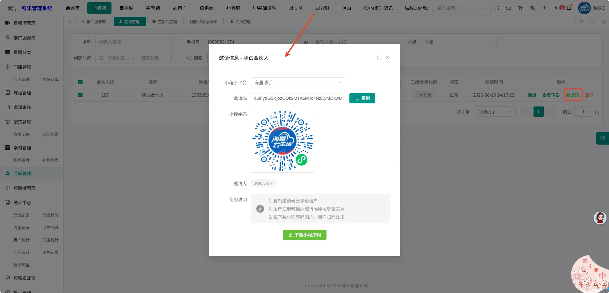
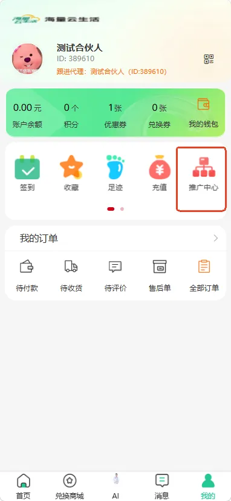
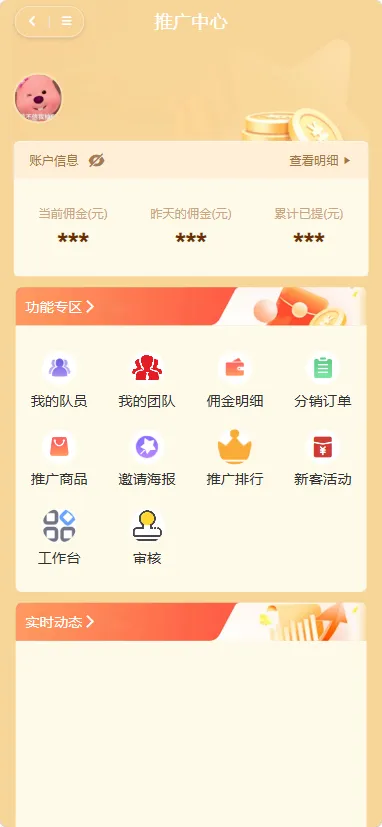

# 普通用户怎么变为合伙人

### **管理后台-会员列表**

#### **方式一：常用于在后台添加合伙人**

###### **第一步：进入会员管理页面，筛选项 用户信息- 手机号输入手机号，点击搜索**

###### **第二步：下方展示筛选出来的会员信息**

###### **第三步：操作下方展示按钮：设为合伙人，点击按钮，该用户成为合伙人**

###### **第四步：用户成为合伙人，该处展示合伙人标签**

###### **第五步：点击管理后台-直播-区域管理，进入该页面，该页面展示所有的合伙人信息**

###### **第六步：通过搜索合伙人ID，名称，手机号，可精确搜索对应合伙人**

###### **第七步：点击右侧的查看下级，唤起弹窗，弹窗内容展示改合伙人及下级团长**

###### **第八步：点击右侧的编辑按钮，唤起编辑弹窗，可对合伙人信息进行编辑补充**

###### **第九步：点击右侧的邀请码，唤起弹窗，可下载小程序码分享给别的用户，**

注意：用户A身份变为合伙人时，该用户同时也是团长，拥有自己的团；

随后用户A分享小程序码给用户B

用户B通过邀请关系注册，此刻用户B将加入用户A的团，成为团员

###### **第十步：小程序-我的页面，展示推广中心**

#### **方式二：常用于在后台生成邀请链接进行审核**

###### **第一步：**
