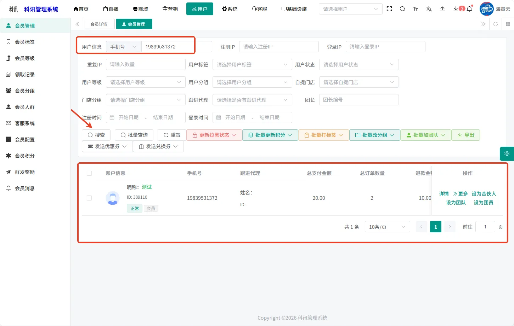
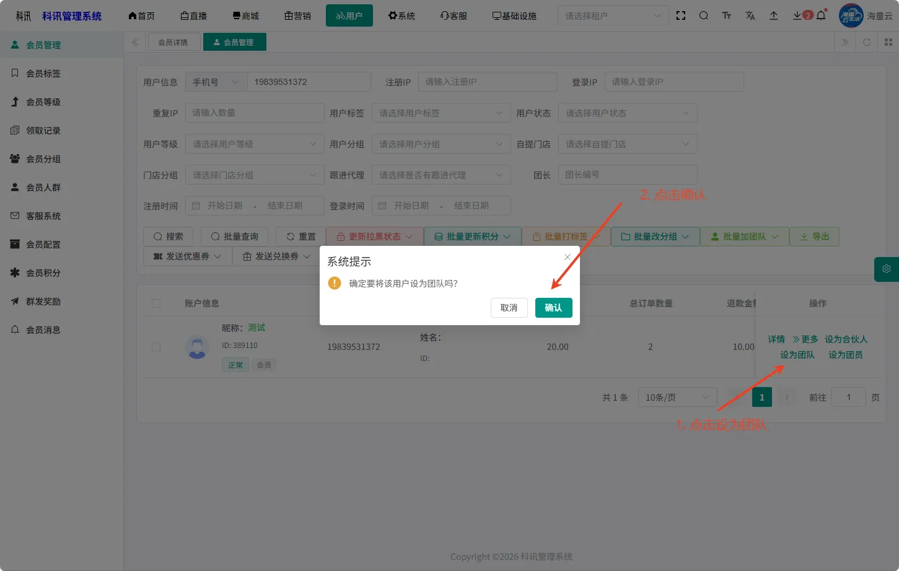
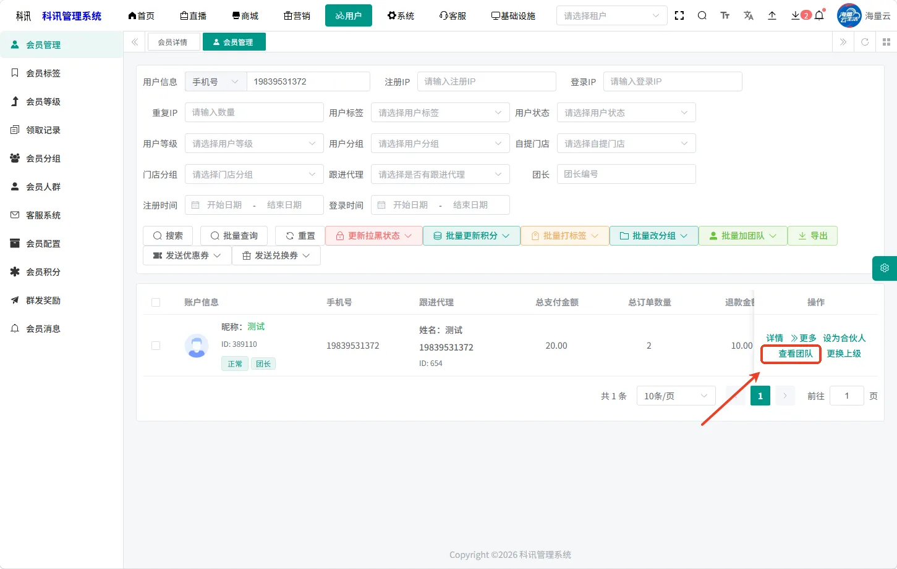
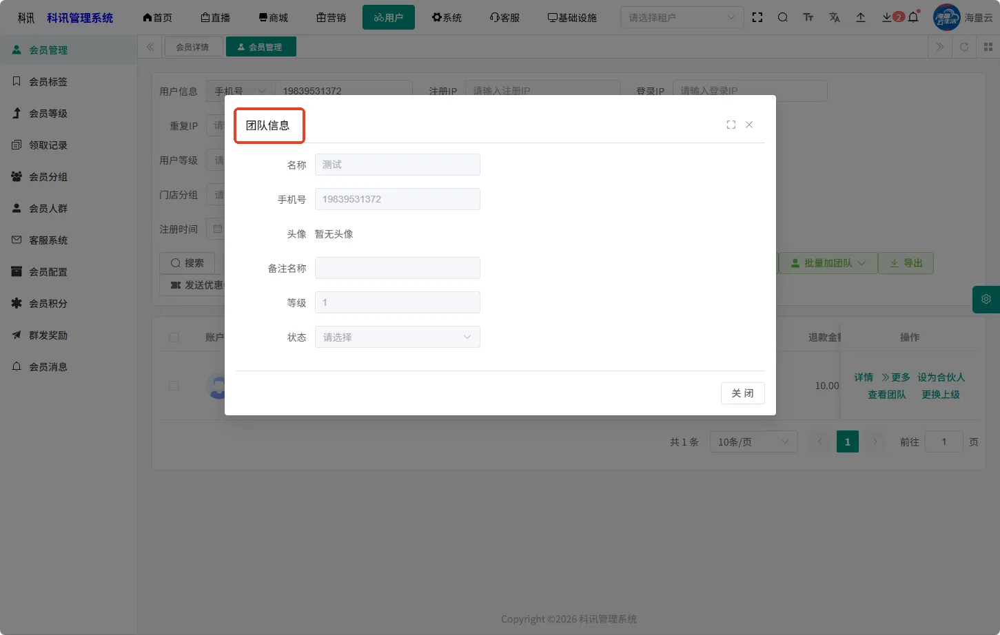
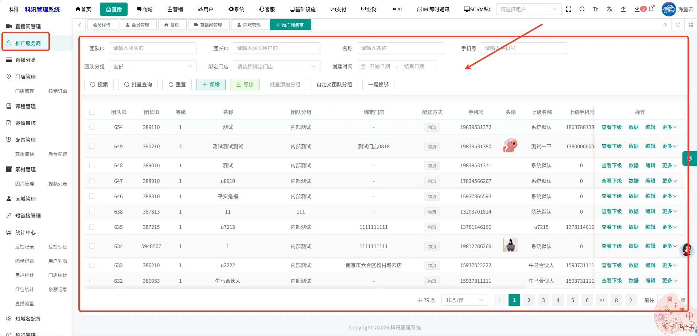
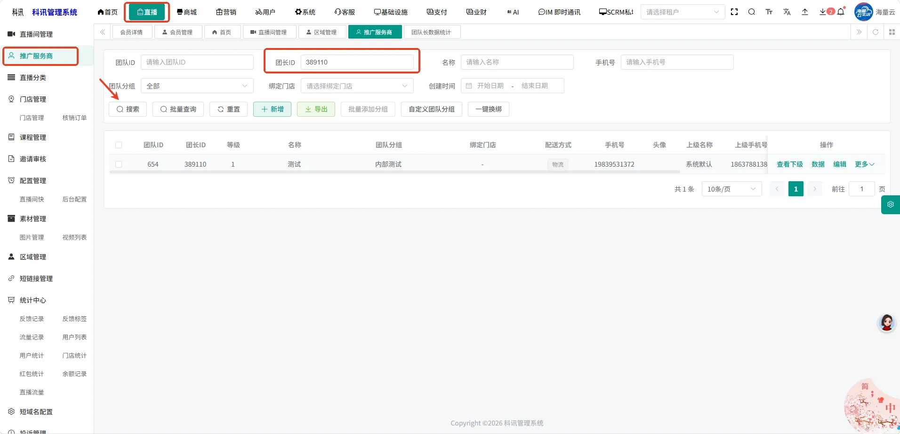
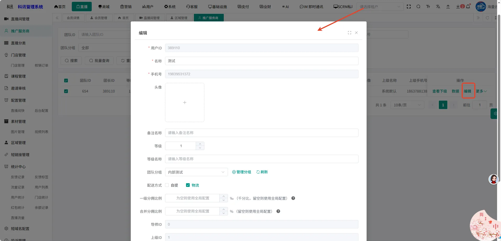
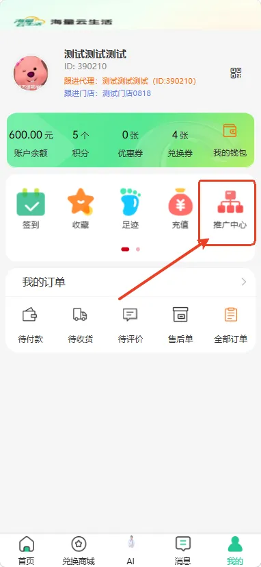
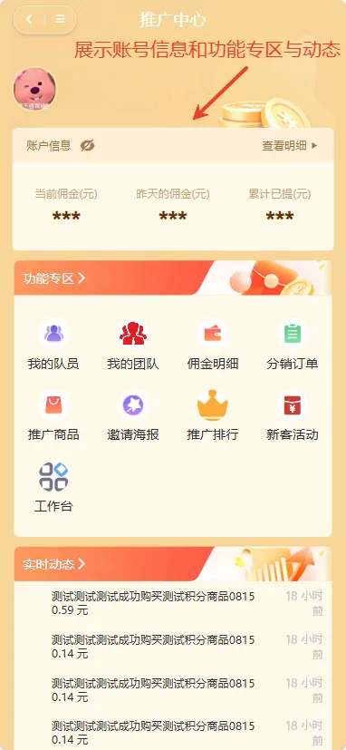

# 普通用户怎么变为团长

### **管理后台-会员列表**

###### **第一步：进入会员管理页面，筛选项 用户信息- 手机号输入手机号，点击搜索**

###### **第二步：下方展示筛选出来的会员信息**

###### **第三步：操作下方展示按钮：设为团队，点击设为团队，该用户成为团长**

###### **第四步：操作下方展示按钮从【设为团队】展示为【查看团队】，点击会唤起弹窗展示团队信息**

###### **第五步：进入直播模块-推广服务商列表，此处展示所有的团队**

###### **第六步：进入直播-推广服务商页面，通过团长ID可搜索刚刚创建的团队信息，编辑团队基础信息**

###### **第七步：小程序-我的页面，展示推广中心**

