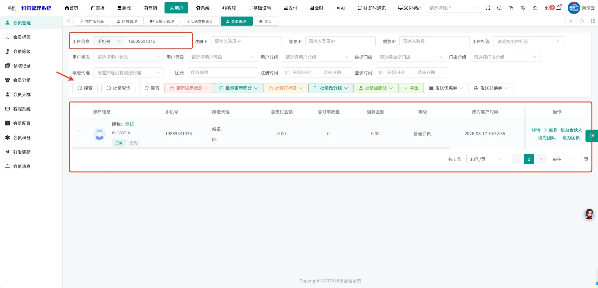
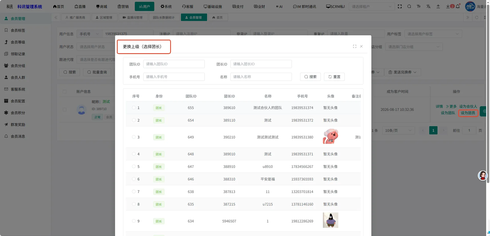
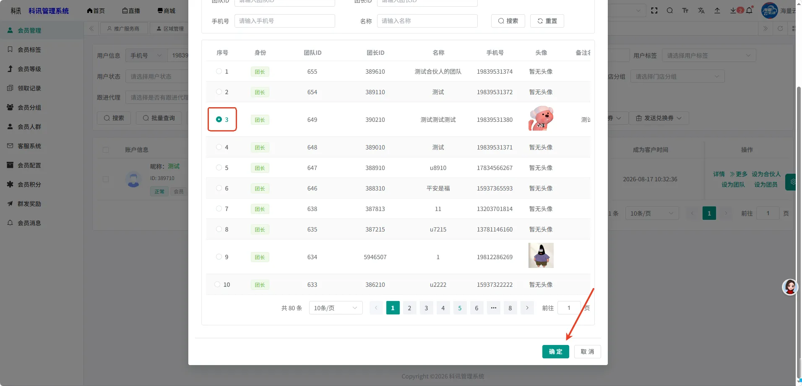
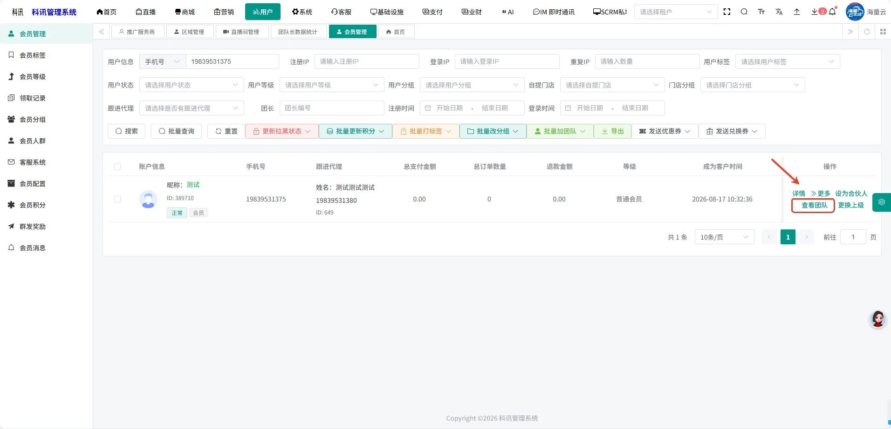
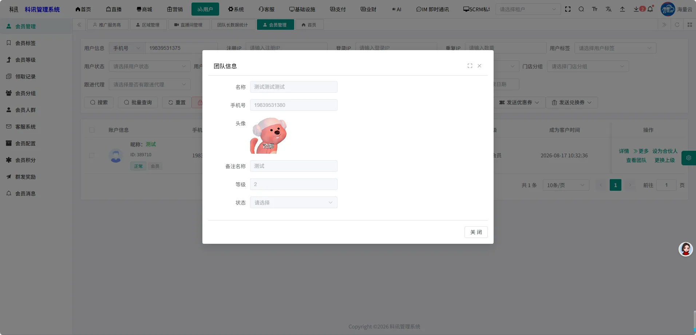
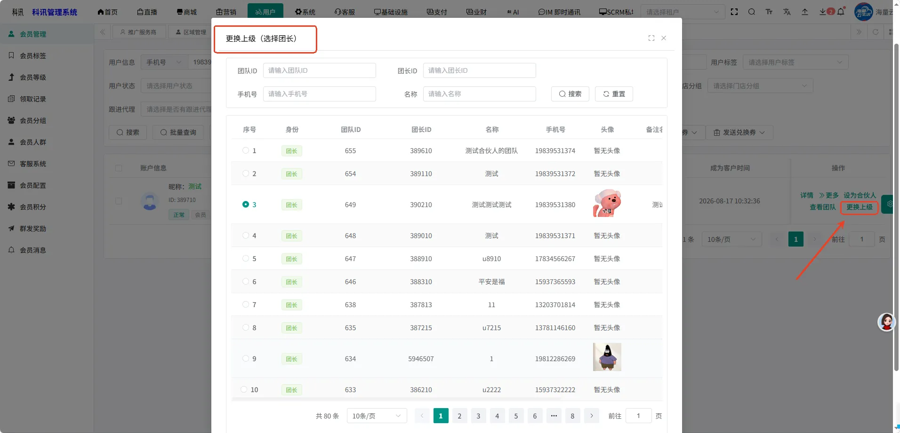
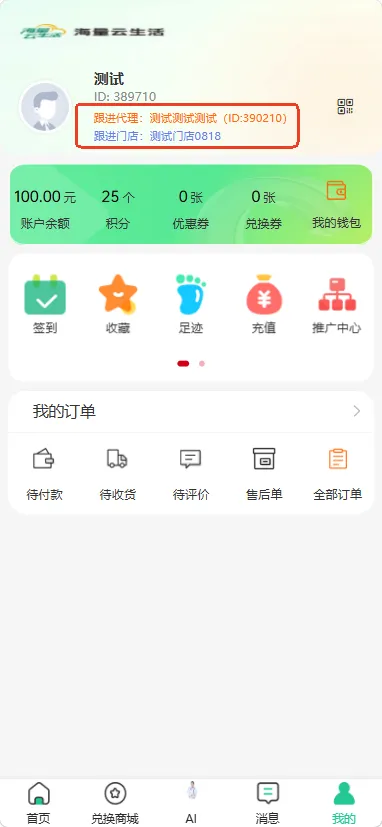

# 普通用户怎么成为团员

###### **第一步：进入会员管理页面，筛选项 用户信息- 手机号输入手机号，点击搜索**

###### **第二步：下方展示筛选出来的会员信息**

###### **第三步：操作下方展示按钮：设为团员，点击设为团员，该用户成为对应的团的团员**

可以通过团队ID，团长ID，团长手机号，名称，进行搜索对应的团

随后选择对应的团，点击确认，则加入成功

###### **第四步：点击右侧的查看团队，查看用户所在团的团队信息**

###### **第五步：点击右侧的更换上级，可以更换用户所在的团**

###### **第六步：加入团队后，用户的小程序页面展示跟进代理**

